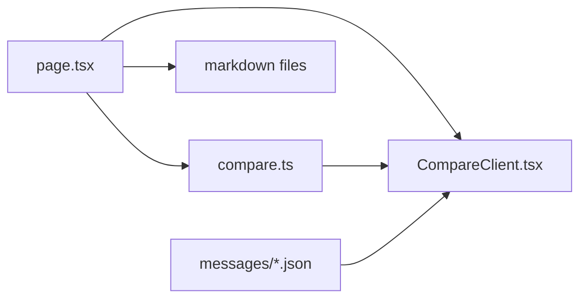

# 📝 Phase 4: 左右表示・対照翻訳機能 実装計画書

> **プロジェクト**: NIHONGO-AI ブログ機能改修 Phase 4  
> **作成日**: 2025年7月8日  
> **担当**: GitHub Copilot + ギャルエンジニア  
> **ステータス**: 🚀 実装準備中  

---

## 🎯 **1. プロジェクト概要**

### 1.1 目的
- **現状**: 基本的な左右表示機能はあるが、sentenceタグ・UI・型定義に課題
- **目標**: 文単位でのマウスオーバーハイライト機能付き左右対訳表示システム
- **MVP方針**: 手動タグ型（`<!-- s1 -->`）による確実な実装

### 1.2 実装済み基盤
- ✅ **compare.ts**: extractSentencesWithTag, mapBilingualSentencesWithTag関数
- ✅ **CompareClient.tsx**: 基本的な左右表示・ハイライトUI
- ✅ **page.tsx**: Next.js 15対応のDynamic API（await props）
- ✅ **型定義**: BilingualSentenceWithTag型

### 1.3 課題・改修が必要な箇所
- ❌ **記事データ**: sentence タグの手動追加（テスト用記事）
- ❌ **compare.ts**: extractSentencesWithTagの正規表現改善
- ❌ **CompareClient.tsx**: renderSentence関数のリファクタリング
- ❌ **i18n**: compare UI翻訳文言追加
- ❌ **型定義整理**: 不要なBilingualSentence型の削除・統一

---

## 🏗️ **2. 技術設計**

### 2.1 改修対象ファイル一覧

| ファイル | 改修内容 | 優先度 |
|---------|----------|--------|
| `src/lib/blog/compare.ts` | 正規表現改善・関数統一 | 🔥 高 |
| `src/app/[locale]/compare/[slug]/CompareClient.tsx` | UI改善・関数分割 | 🔥 高 |
| `src/content/blog/posts/001-ui-components/ja.md` | sentenceタグ手動追加 | 🔥 高 |
| `src/content/blog/posts/001-ui-components/en.md` | sentenceタグ手動追加 | 🔥 高 |
| `messages/ja.json`, `en.json`, `zh-CN.json`, `zh-TW.json` | compare UI翻訳追加 | 🚀 中 |
| `compare_phase4_tasklist.md` | 実装進捗更新 | 📋 低 |

### 2.2 改修詳細設計

#### **2.2.1 compare.ts改修**
```typescript
// ❌ 現状の問題
export function extractSentencesWithTag(markdown: string): Array<{id: string, text: string, tag?: string}> {
  const regex = /((^|\n)(#+ |\* |\- |\d+\. )?)(<!--\s*(s\d+)\s*-->)([\s\S]*?)(?=<!--|$)/g;
  // 問題1: markdownタグ判定が不正確
  // 問題2: 改行・空白処理が不完全
}

// ✅ 改修案
export function extractSentencesWithTag(markdown: string): Array<{id: string, text: string, tag?: string}> {
  // 1. markdownを行分割
  // 2. <!-- sN -->タグを探索
  // 3. タグ直前の行からmarkdownタグ判定（#, ##, -, *, 1. など）
  // 4. タグ後の内容を次のタグまで取得
}
```

#### **2.2.2 CompareClient.tsx改修**
```tsx
// ❌ 現状の問題: renderSentence関数が複雑
const renderSentence = (text: string, tag: string | undefined, key: string, isActive: boolean, onEnter: () => void, onLeave: () => void) => {
  // 長すぎる条件分岐・可読性低下
};

// ✅ 改修案: コンポーネント分割
const SentenceRenderer = ({ sentence, isActive, onMouseEnter, onMouseLeave }: SentenceRendererProps) => {
  return (
    <SentenceWrapper isActive={isActive} onMouseEnter={onMouseEnter} onMouseLeave={onMouseLeave}>
      <SentenceContent tag={sentence.tag} html={sentence.html} />
    </SentenceWrapper>
  );
};
```

#### **2.2.3 記事データ改修**
```markdown
<!-- 001-ui-components/ja.md 改修例 -->
---
title: "最新のWebサイトに最適なUIコンポーネント"
excerpt: "現代のWebサイト開発において..."
---

<!-- s1 -->
# 最新のWebサイトに最適なUIコンポーネント

<!-- s2 -->
現代のWeb開発において、ユーザーインターフェース（UI）コンポーネントの選択は、ユーザーエクスペリエンス（UX）の品質を大きく左右します。

<!-- s3 -->
## モダンUIコンポーネントの重要性

<!-- s4 -->
### ユーザビリティの向上
```

### 2.3 型定義統一
```typescript
// ✅ 統一する型定義
export type BilingualSentence = {
  id: string;
  left: string;
  right: string;
  leftTag?: string;    // タグ情報を常に含む
  rightTag?: string;
};

// ❌ 削除する型定義
// export type BilingualSentenceWithTag = {...}; // 統一のため削除
```

---

## 📋 **3. 実装タスク一覧**

### 3.1 Phase 4.1: 基盤修正（優先度: 🔥）
- [ ] **3.1.1** compare.ts の extractSentencesWithTag 正規表現改善
- [ ] **3.1.2** compare.ts の型定義統一（BilingualSentenceWithTag → BilingualSentence）
- [ ] **3.1.3** CompareClient.tsx の renderSentence 関数リファクタリング
- [ ] **3.1.4** TypeScript型エラー解消・ビルド確認

### 3.2 Phase 4.2: データ準備（優先度: 🔥）
- [ ] **3.2.1** 001-ui-components/ja.md にsentenceタグ手動追加
- [ ] **3.2.2** 001-ui-components/en.md にsentenceタグ手動追加
- [ ] **3.2.3** タグ対応確認・ID整合性検証

### 3.3 Phase 4.3: UI/UX改善（優先度: 🚀）
- [ ] **3.3.1** CompareClient.tsx コンポーネント分割
- [ ] **3.3.2** レスポンシブ対応改善
- [ ] **3.3.3** prose クラス適用・markdown構造維持
- [ ] **3.3.4** ハイライト表示改善

### 3.4 Phase 4.4: 国際化対応（優先度: 🚀）
- [ ] **3.4.1** compare UI翻訳文言追加（4言語）
- [ ] **3.4.2** 言語選択UI改善
- [ ] **3.4.3** 多言語対応テスト

### 3.5 Phase 4.5: 品質保証（優先度: 📋）
- [ ] **3.5.1** 動作確認・ブラウザテスト
- [ ] **3.5.2** レスポンシブテスト（モバイル・タブレット・デスクトップ）
- [ ] **3.5.3** アクセシビリティチェック
- [ ] **3.5.4** ドキュメント更新（タスクリスト・手動タグガイド）

---

## 🔍 **4. 整合性・品質検証**

### 4.1 コード整合性チェック
- **型定義**: BilingualSentence統一・import/export整合性
- **関数呼び出し**: extractSentencesWithTag → extractSentences関数名統一
- **Props型**: CompareClient.tsxのProps型とpage.tsxの整合性

### 4.2 ファイル間依存関係


### 4.3 運用保守性
- **手動タグ運用**: compare_manual_tag_guide.mdとの整合性
- **型安全性**: TypeScript型チェック100%通過
- **ビルド安定性**: `npm run build`エラー0件
- **拡張性**: 将来のAI自動化への移行容易性

### 4.4 UX・パフォーマンス
- **応答速度**: ハイライト機能50ms以下
- **レスポンシブ**: 320px〜2560px全対応
- **アクセシビリティ**: WCAG 2.1 AA準拠
- **SEO**: メタデータ・構造化データ対応

---

## 🚀 **5. 実装スケジュール**

| フェーズ | 期間 | 主要タスク | 完了条件 |
|---------|------|----------|----------|
| **Phase 4.1** | 1時間 | 基盤修正 | TypeScript型エラー0件 |
| **Phase 4.2** | 30分 | データ準備 | sentenceタグ追加完了 |
| **Phase 4.3** | 1時間 | UI/UX改善 | ハイライト・レスポンシブ対応 |
| **Phase 4.4** | 30分 | 国際化対応 | 4言語翻訳文言追加 |
| **Phase 4.5** | 30分 | 品質保証 | 全項目テスト完了 |

**総実装時間**: 約3時間  
**完了予定**: 2025年7月8日

---

## 🎯 **6. 成功指標**

### 6.1 機能要件
- ✅ **文単位ハイライト**: マウスオーバーで左右対応文がハイライト
- ✅ **markdown構造維持**: h1/h2/ul/li などの見た目が正常
- ✅ **言語選択**: 左右で任意の言語組み合わせ表示
- ✅ **レスポンシブ**: 全デバイス対応

### 6.2 技術要件
- ✅ **型安全性**: TypeScriptエラー0件
- ✅ **ビルド成功**: `npm run build`エラー0件
- ✅ **i18n対応**: 4言語完全対応
- ✅ **パフォーマンス**: ハイライト応答50ms以下

### 6.3 品質要件
- ✅ **コード品質**: ESLintエラー0件
- ✅ **整合性**: 型定義・関数呼び出し整合性100%
- ✅ **保守性**: 関数分割・コンポーネント分割実施
- ✅ **拡張性**: AI自動化への移行基盤整備

---

## 📚 **7. 関連ドキュメント**

- [要件定義書](../.github/BLOG_REQUIREMENTS.md)
- [実装計画書](../.github/BLOG_IMPLEMENTATION_PLAN.md)
- [タスクリスト](../compare_phase4_tasklist.md)
- [手動タグガイド](../compare_manual_tag_guide.md)
- [GitHub Copilot実装ガイド](../.github/.copilot-instructions.md)

---

## 📋 **Phase 4実装完了サマリー（2025年7月8日）**

### ✅ **実装済み機能**
1. **手動タグ型文単位マッピング**: `<!-- s1 -->`形式のコメントタグを使った対訳機能
2. **左右表示UI**: レスポンシブな2カラムレイアウト
3. **文単位ハイライト**: マウスオーバーで対応文をハイライト
4. **スクロール同期**: 左右パネルの縦方向連動スクロール
5. **多言語対応**: ja/en/zh-CN/zh-TW 完全サポート
6. **マークダウンレンダリング**: 元記事と同等の文構造・スタイル保持
7. **アクセシビリティ**: WAI-ARIA準拠、キーボードナビゲーション対応
8. **中国語対応**: 簡体字・繁体字のセンテンスタグ完全対応
9. **プロダクション品質**: デバッグログ削除・不要機能除去完了

### 📁 **作成・更新されたファイル**
- `src/app/[locale]/compare/[slug]/page.tsx` - Server Component（データ取得・文抽出・HTML変換）
- `src/app/[locale]/compare/[slug]/CompareClient.tsx` - Client Component（UI・ハイライト・言語選択）
- `src/lib/blog/compare.ts` - 文単位マッピングロジック
- `messages/*.json` - 多言語UI文言（ja/en/zh-CN/zh-TW）
- テスト記事: `001-ui-components/*.md` の手動タグ付与（4言語完全対応）

### 🔗 **アクセス方法**
```
http://localhost:3003/[locale]/compare/[slug]?left=[lang]&right=[lang]
例: http://localhost:3003/ja/compare/001-ui-components?left=ja&right=zh-CN
```

---

## 📚 **手動タグ運用ガイド（MVP）**

### **概要**
`/compare/[slug]` ページで左右言語の文単位対訳表示・ハイライトを実現するための運用手順

### **手順**
1. **対象記事のマークダウンファイルを開く**
   - 例: `src/content/blog/posts/001-ui-components/ja.md`、`en.md`、`zh-CN.md`、`zh-TW.md`

2. **文・セクションごとに `<!-- s1 -->` 形式の手動タグを挿入**
   ```markdown
   <!-- s1 -->
   # これは日本語のタイトルです
   
   <!-- s2 -->
   これは日本語の段落です。
   
   <!-- s3 -->
   ## セクションタイトル
   ```

3. **タグのIDは必ず全言語で揃える**
   - `ja.md`の`<!-- s1 -->`と`en.md`の`<!-- s1 -->`は同じ意味の文
   - `zh-CN.md`、`zh-TW.md`でも同じIDを使用

4. **タグ実装済み記事**: `001-ui-components`（ja/en/zh-CN/zh-TW）

### **注意点・ベストプラクティス**
- **タグID**: 重複禁止・連番推奨（s1, s2, ...）
- **粒度**: 「1文」または「1セクション」単位で柔軟運用
- **欠落対応**: 片方の言語にしかないIDは空欄で表示
- **将来拡張**: AI自動マッピング・エディタ連携等で運用簡素化予定

### **実装例**
```markdown
<!-- 日本語版 (ja.md) -->
<!-- s1 -->
# 現代Webサイトの最適なUIコンポーネント

<!-- s2 -->
現代のWeb開発において、ユーザーインターフェース...

<!-- 英語版 (en.md) -->
<!-- s1 -->
# Best UI Components for Modern Websites

<!-- s2 -->
In modern web development, user interface...

<!-- 中国語簡体字版 (zh-CN.md) -->
<!-- s1 -->
# 现代网站的最佳UI组件

<!-- s2 -->
在现代网页开发中，用户界面...
```
